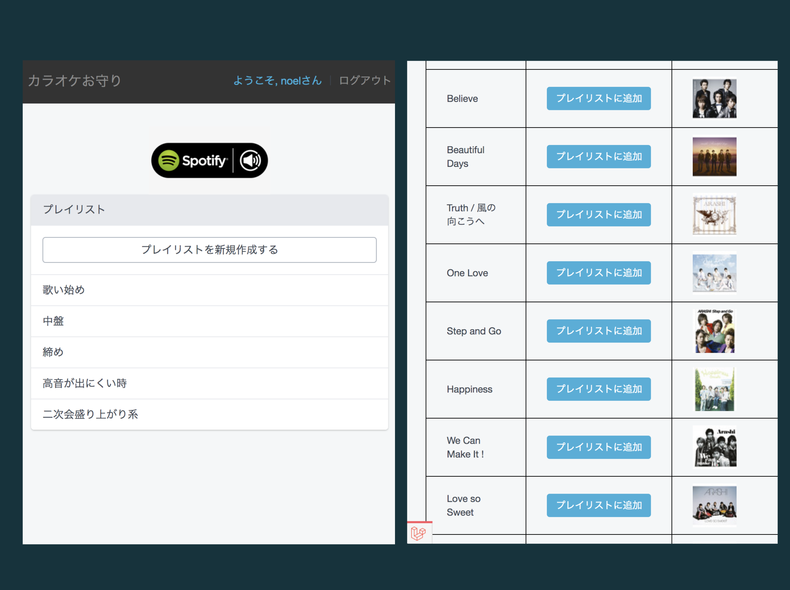

# Karaoke Charm

<h2 align="center">Table of Contents</h2>

1. [Getting Started](#getting-started)
2. [Environments](#environments)
3. [Installation](#installation)
4. [Run tests](#run-tests)
5. [Authors](#authors)
6. [License](#license)

<h2 align="center">Getting Started</h2>
<!-- - [Installation](#) -->

- [Laravel Framework Integration](#)  
- [Basic Usage](#)  

<h2 align="center">Environments</h2>

|                                                                                 Icon                                                                                  |     Name      |   Version   | Description                                                                             |
| :-------------------------------------------------------------------------------------------------------------------------------------------------------------------: | :-------------: | :--------------: | :-------------------------------------------------------------------------------------- |
|     |   PHP   |   7.3   | general-purpose scripting language especially suited to web development.      |
|  |  Laravel    |   6.18.40   | PHP web framework, created by Taylor Otwell    |
|   |  intervention/image  |  2.5.1  |  (Supposed to be written)   |
|    | aerni/laravel-spotify |  -  | (Supposed to be written)  |
|    |  barryvdh/laravel-debugbar   |  3.5.1    | (Supposed to be written)  |
|    |  nunomaduro/larastan  |  0.6.9  | (Supposed to be written)  |
|    |  MySQL   |  5.7   | (Supposed to be written)  |
|    |  Nginx   |  1.19   | (Supposed to be written)  |

<h2 align="center">Installation</h2>

#### (1) フォルダ名を指定してClone
~~~bash
git clone {this repository[with https protocol]} karaoke
~~~
  

#### (2) .envの作成
~~~bash
cp .env.development .env
~~~
  

#### (3) コンテナのビルド・起動
~~~bash
docker-compose up -d
~~~
  

#### (4) composerによる依存パッケージのインストール

~~~bash 
(開発環境)
composer install --dev

(本番環境)
composer install
~~~

#### (5) 暗号化キーの作成

~~~bash
php artisan key:genrate
~~~

#### (6) マイグレーション & シーディング

~~~bash
docker-compose exec php bash

php artisan migrate --seed
~~~

#### (7) シンボリックリンクを作成

~~~bash
php artisan storage:link
~~~

<h2 align="center">Run tests</h2>

~~~bash
# 全て実行
./vendor/bin/phpunit --testdox
~~~

<h2 align="center">Authors</h2>

[Noël (zidane-enlir)](https://github.com/zidane-enlir)

<h2 align="center">License</h2>
This project is licensed under the MIT License  
